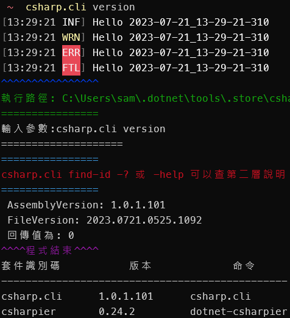

# cs.cli
# 介紹
C# 製作成的 CLI
- CLI 是命令列介面 (Command-Line Interface)
以指令與電腦互動
- GUI 是圖形化介面 (Graphical User Interface)

---

# CLI 常用指令有哪些？
Windows 作業系統為例，常用的指令如下：  
cd	=> 切換目錄  
pwd	=> 取得目前所在位置  
cp	=> 複製檔案  

---

# 建立 nuget 專案
```bash=
dotnet new console -lang c#
```
- 在 *.csproj 下新增下面三行
```xml=
<PackAsTool>true</PackAsTool>
<ToolCommandName>csharp.cli</ToolCommandName>
<PackageOutputPath>./nupkg</PackageOutputPath>
```

---

# 安裝 nuget
- 編譯
```bash=
dotnet build
```
看看有沒有錯誤訊息
- 產生 nupkg
```bash=
dotnet pack
```
- 安裝全域 nuget 套件
```bash=
dotnet tool install --global --add-source .\nupkg csharp.cli
```
- 查看全域 nuget 套件
```bash=
dotnet tool list -g
```
- 測試 csharp.cli 是否安裝成功 
```bash=
csharp.cli --help
```


---

# 解除 csharp.cli 安裝
- 解除安裝全域 csharp.cli 的 nuget 套件
```bash=
dotnet tool uninstall -g csharp.cli
```

---

# 本地安裝 nuget 套件批次檔案
```bash=
.\install.bat
```
會循序進行清理目錄、打包、移除套件、安裝套件並顯示套件安裝版本  

---

# 編譯警告
搜尋 #pragma warning disable 就能找到

---

# excel-convert
```bash=
excel-convert "C:\github\RoyalTemporaryFile\直接進桌\AllTableList.xlsx" "sheet" "table"
```
"C:\github\RoyalTemporaryFile\直接進桌\AllTableList.xlsx" Excel 的檔案路徑，通常跟 "table" 會有關
"sheet" 盡量同名就好
"club" 是 PWAWebSiteAllClubTypeListResponse 類別
"table" 是 PWAWebSiteAllTableListResponse 類別

# bet-area
- 讀取 resoure 目錄內的 bet-area.json 檔案，列出 bet-area 的查詢結果
查詢 betArea 指令說明
- c: 查詢翻譯內容
- i: 查詢 AreaId
- a: csv 指定檔案路徑，列出全部的翻譯內容
- g: 指定 bet-area.json 檔案，列出全部的翻譯內容
```bash=
csharp.cli  bet-area Bacc -c 閒
csharp.cli  bet-area Bacc -i 1
csharp.cli  bet-area Bacc -a C:\royal\github\RoyalTemporaryFile\WM\csv\百家樂.csv
csharp.cli  bet-area Bacc -a 1
```

---

# add-customer
利用 Redis 上的 Json 設定腳本，自動修改或新增目標路徑的內容
Redis 為本地端，並非遠端，所以不用擔心安全性問題，連線字串為: 127.0.0.1@6379
Redis 的 Windows 版本下載網址: https://github.com/MicrosoftArchive/redis/releases
Redos 的 Client 端下載網址: https://github.com/qishibo/AnotherRedisDesktopManager
Redis 的 Client 端也可以用 choco install another-redis-desktop-manager 安裝
或是用winget install qishibo.AnotherRedisDesktopManager 安裝
Redis 的唯一 key 為 `csharp.cli:add-customer`
腳本參考: https://hackmd.io/@chiisen/B1Drd6djn
目前只有 COPY 新增檔案、INSERT 新增程式碼
腳本中的 ##CUSTOMER## 為全大寫，例如: PME
腳本中的 ##CUSTOMER1## 為第一個字大寫，例如: Pme
腳本中的 ##CUSTOMER2## 為全小寫，例如: pme
```bash=
csharp.cli add-customer
``` 

# add-games
新增遊戲(多數參數會由 Redis 上提供)
```bash=
csharp.cli add-games "thirdPartyId 廠商的英文代號"
``` 
---

# bet-area-all
讀取 .bet-area 設定檔案，列出 bet-area 的結果
```bash=
csharp.cli bet-area-all
```

---

# cache
測試 cache
```bash=
csharp.cli cache -r keyName
```

---

# csv
讀取 csv 的 AreaId 並且比對 betArea.json 的資料
```bash=
csharp.cli csv "C:\royal\github\RoyalTemporaryFile\WM\csv\百家樂.csv" -b Bacc
```

---

# echo
輸出用戶輸入的文字。
```bash=
csharp.cli echo "Hello World" -r 3
```

---

# environment
取得環境變數 "path"
```bash=
csharp.cli environment
```

# event-news
Event News (工作自動化)
```bash=
csharp.cli event-news "EXCEL完整路徑與檔案名稱" "sheet名稱"
```

---

# example
範例程式
```bash=
csharp.cli example "words" -r 10
```

---

# excel
EXCEL 讀寫測試範例
```bash=
csharp.cli excel "EXCEL的完整路徑與檔案名稱" "sheet名稱"
```

---

# json
讀取 json 範例程式
測試用只能指定特定 class 的 json 檔案
```bash=
csharp.cli json "C:\royal\github\RoyalTemporaryFile\MG\BetRecordHistory.json"
```

---

# multi-thread
multi-thread 範例程式
```bash=
csharp.cli multi-thread
```

---

# polly
重試測試。
```bash=
csharp.cli polly
```

---

# ps
PowerShell 範例程式
```bash=
csharp.cli ps
```

---

# pwd
顯示常用路徑
```bash=
csharp.cli pwd
```

---

# version
查詢版本號
```bash=
csharp.cli version
```
