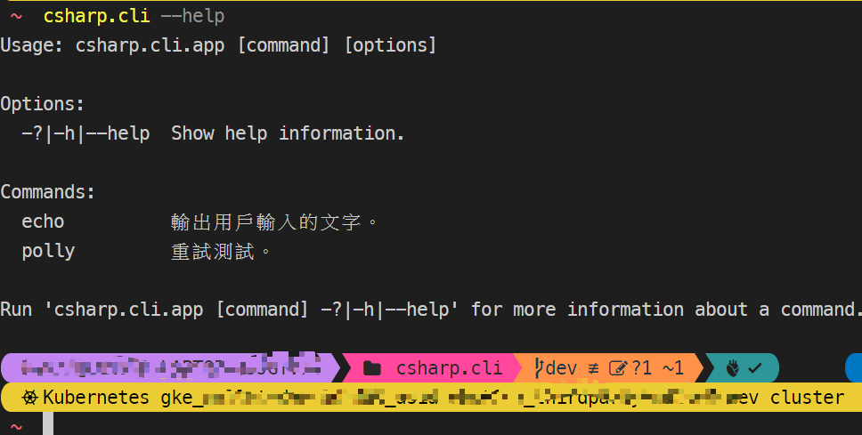

# cs.cli
# 介紹
C# 製作成的 CLI
- CLI 是命令列介面 (Command-Line Interface)
以指令與電腦互動
- GUI 是圖形化介面 (Graphical User Interface)

---

# CLI 常用指令有哪些？
windows 作業系統為例，常用的指令如下：  
cd	=> 切換目錄  
pwd	=> 取得目前所在位置  
cp	=> 複製檔案  

---

# 建立專案
```bash=
dotnet new console -lang c#
```
- 在 *.csproj 下新增下面三行
```xml=
<PackAsTool>true</PackAsTool>
<ToolCommandName>csharp.cli</ToolCommandName>
<PackageOutputPath>./nupkg</PackageOutputPath>
```

---

# 安裝
- 產生 nupkg
```bash=
dotnet pack
```
- 安裝全域套件
```bash=
dotnet tool install --global --add-source .\nupkg csharp.cli
```
- 查看全域套件
```bash=
dotnet tool list -g
```
- 測試是否安裝成功 
```bash=
csharp.cli --help
```


---

# 解除安裝
- 解除安裝全域套件
```bash=
dotnet tool uninstall -g csharp.cli
```

---

# 本地安裝套件批次檔案
```bash=
.\install.bat
```
會循序進行清理目錄、打包、移除套件、安裝套件並顯示套件安裝版本  

---

# echo
輸出用戶輸入的文字。
```bash=
csharp.cli echo "Hello World" -r 3
```
# polly
重試測試。
```bash=
csharp.cli polly
```

# bet-area
查詢 betArea
```bash=
csharp.cli bet-area LongHu -a "C:\csvFilePath.csv"
```

# cache
測試 cache
```bash=
csharp.cli cache -r keyName
```

# version
查詢版本號
```bash=
csharp.cli version
```
